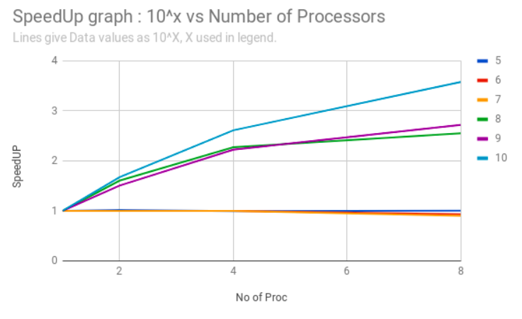

# Prime Number Generation using  Parallelised Sieve of Eratosthenes Algorithm

## Aim

- To find all primes less than N (an input integer) using Sieve of Eratosthenes algorithm parallelized using Message Passing model.

## Approach

- The approach uses the Single Program Multi-Data model of parallel programming. The range of N is divided into equal parts and given to each process. This ensures roughly equal work-load on each process. Since N is previously known to each process, the range division doesn't require any communication.
- All the primes less than square root of the upper limit of each process are found serially and saved in a list. Once the primes less than root of upper limit are identified, these numbers are used to mark the larger sequence from lower to upper limit of process.
- After the above two steps the elements of the list that remain unmarked are prime numbers, which are then collected at the root process and displayed.

### Definitions

- N : Range of integers upto which prime numbers have to be generated.
- P : The total number of processes used for computation.

## Underlying Architecture

- The program was thoroughly tested and optimized for a distributed Beowulf style cluster which uses Message Passing for communication over Ethernet switches.
- All the Nodes/Cores in the cluster have identical configuration, Operating system and Architectures.
- In the context of this solution when we speak of the number of Processes, we assume each process runs on a different Node/Core in the cluster


## Optimizations

- All the lists are implemented as bit vectors to minimize memory requirements and decrease the communication overheads.
- Macros have been used wherever applicable to decrease the stack frame allocation/deallocation for basic bit vector operations.
- Skip counting is used to ignore every multiple of 2, i.e. only odd numbers are checked for Primality.
- While marking primes across the entire length of the array sequentially, the algorithm suffers a lot of cache misses. We can break the entire range into small segments which occupy memory equivalent to the page size. On each segment we can mark all the multiples before moving to the next, thus minimizing the cache misses. (Integration of this is not done yet.)

## Results

- Time is given in seconds

| Number of Processes / Input Size (10 ^ x) | 5 | 6 | 7 | 8 | 9 | 10 |
|:---:|:---:|:---:|:---:|:---:|:---:|:---:|
| 1 | 0.001576 | 0.014732 | 0.15232 | 0.8900 | 10.134133 | 115.786242 |
| 2 | 0.00155 | 0.014733 | 0.152345 | 0.554826 | 6.7263 | 69.191692 |
| 4 | 0.001585 | 0.01475 | 0.152345 | 0.391887 | 4.558563| 44.338294 |
| 8 | 0.001571 | 0.015786 | 0.16874 | 0.348543 | 3.727596 | 32.374635 |



### Analysis

- The approach scales well for large N and more number of processes.
- As the input values increase the communication overhead becomes less important factor and hence performance improves. For smaller values run-time is very small and overheads outweigh any gains from parallelization.

## Dependencies

- MPICH2 / OpenMPI
- gcc 5.4.0

## Compiling and Running

- For compiling the code
	- `make compile`
- For running the program on `num` processes for 10 ^ `lim` range
	- `make run n=num limit=lim`
- Example
```bash
	$ make compile
	$ make run n=4 lim=9
```

## [Original Development Repository](https://github.com/atalukdar/ParaCompCourseProjects)

# Authors

- [Abhishek V Joshi](https://github.com/jbnerd)
- [Shyamal Vaderia](https://github.com/svaderia)
- [Arka Talukdar](https://github.com/atalukdar)
